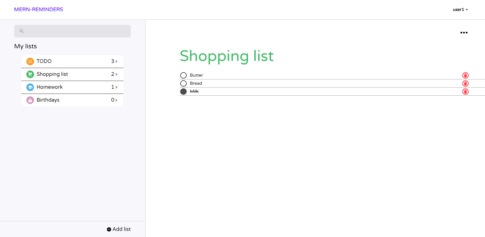

# MERN-Reminders

The Reminders Web Application is a robust task management system inspired by Apple's Reminders application, designed to enhance user productivity and organization. The application employs a modern and efficient tech stack, featuring React for the frontend and Node.js, Express, MongoDB, and Mongoose for the backend, with a RESTful API architecture.

Key Features:

    Intuitive User Interface:
        The frontend, built with React, offers a seamless and intuitive user experience. The interface is designed for ease of use, facilitating efficient navigation and featuring an aesthetically pleasing design.

    Task Management:
        Users can effortlessly create, edit, and delete tasks. The application supports task organization into lists or categories, allowing for a structured and personalized approach to task management.

    Secure Authentication with Password Hashing:
        Robust user authentication is implemented, ensuring the security of user data. Passwords are securely hashed using industry-standard cryptographic algorithms, safeguarding user accounts against unauthorized access.

    RESTful API:
        The backend, powered by Node.js and Express, hosts a scalable and efficient RESTful API. This API facilitates seamless communication between the frontend and backend, supporting various CRUD operations for tasks and user-related data.

    Database Integration:
        MongoDB, a NoSQL database, is integrated with Mongoose for efficient data storage and retrieval. This combination provides flexibility and scalability for managing task-related information.

    Customizable Lists with Color and Icons:
        Users can personalize their task lists by changing colors and assigning icons. This feature enhances the user experience, allowing for a more visually engaging and tailored task management environment.

    Scalability and Performance:
        The architecture is designed for scalability, enabling the application to handle a growing user base. Asynchronous programming and optimized database queries ensure optimal performance even under increased load.

    Responsive Design:
        The web application is responsive, offering a consistent user experience across various devices, including desktops, tablets, and mobile phones.

---

### Prieview Image:

## 

[Click to view live demo](https://mern-reminders-client.onrender.com) (Warning, server may not load due to inactivity)
